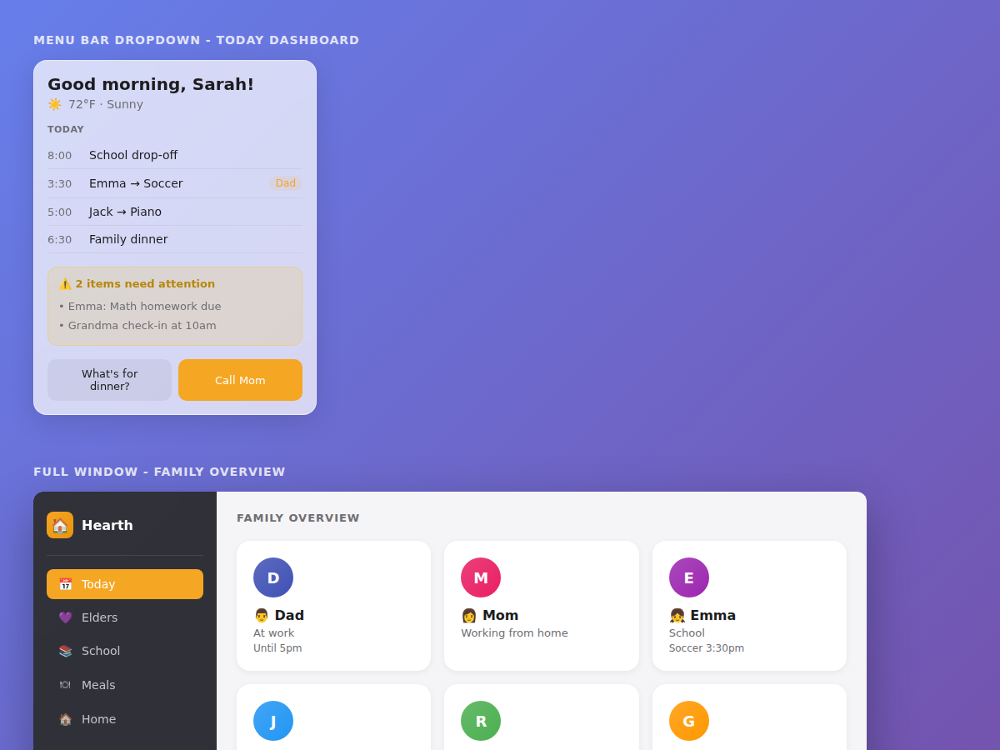
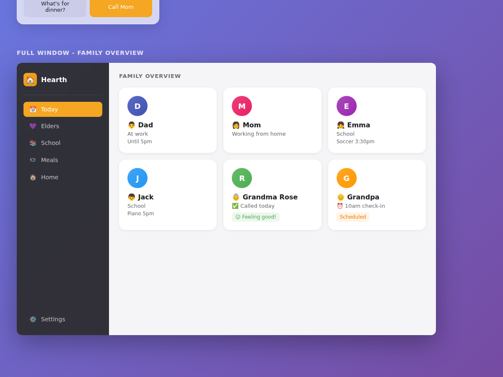
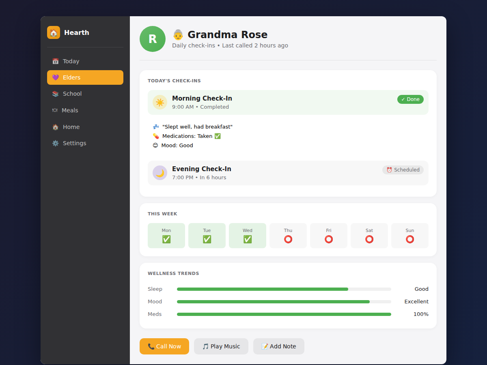
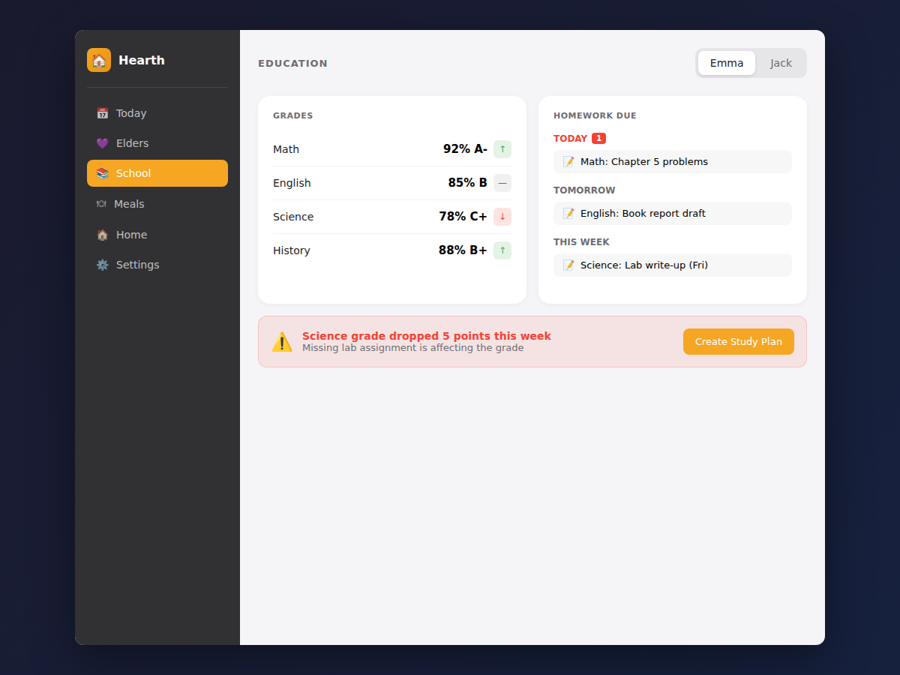
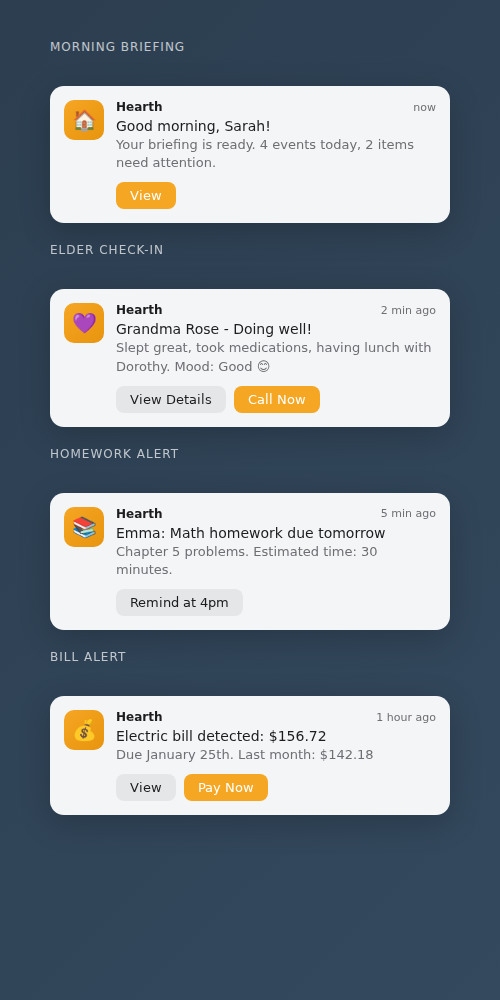
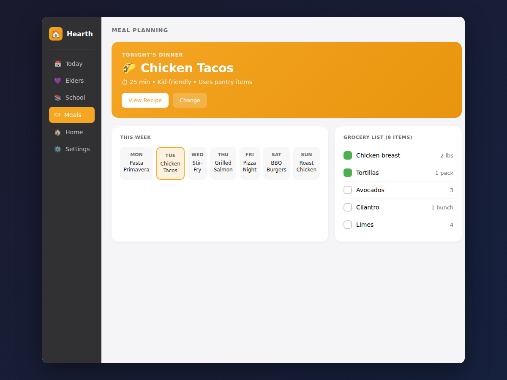

# Hearth Mockups

> High-fidelity UI mockups for the Hearth Mac app, following Apple's Liquid Glass design language.

## Mockup Gallery

### 1. Menu Bar Dropdown - Today Dashboard

**Features shown:**
- Personalized greeting with weather
- Today's family schedule with time and assigned person
- Attention alerts with amber background
- Quick action buttons ("What's for dinner?", "Call Mom")

**Design notes:**
- Frosted glass effect with 72% opacity
- Warm orange (#F5A623) accent color
- SF Pro typography
- Compact but information-dense layout

---

### 2. Full Window - Family Overview

**Features shown:**
- Dark sidebar with navigation
- Family member cards with status
- Elder check-in status (green = called, orange = scheduled)
- Color-coded avatars by role

**Navigation items:**
- Today (calendar icon)
- Elders (heart icon)
- School (book icon)
- Meals (utensils icon)
- Home (house icon)
- Settings (gear icon)

---

### 3. Elder Care Hub

**Features shown:**
- Elder profile header with photo and status
- Today's check-ins (morning/evening) with completion status
- Check-in summary (sleep, medications, mood)
- Weekly completion tracker
- Wellness trends (sleep, mood, medication adherence)
- Quick action buttons (Call Now, Play Music, Add Note)

**State indicators:**
- ✅ Done (green badge)
- ⏰ Scheduled (gray badge)
- Progress bars for wellness metrics

---

### 4. Approval Dialog

**Features shown:**
- Modal dialog with blurred backdrop
- Phone icon indicating call action
- Clear title and description
- "Always allow" checkbox for future automation
- Primary ("Call Now") and secondary ("Not Today") buttons

**Design notes:**
- Centered dialog on blurred background
- Large touch targets for buttons
- Clear explanation of what will happen

---

### 5. Education Command Center

**Features shown:**
- Child tabs (Emma, Jack) for switching views
- Grades table with subject, percentage, letter grade
- Trend indicators (up ↑, down ↓, stable —)
- Homework due by timeframe (Today, Tomorrow, This Week)
- Urgent badge for items due today
- Alert banner for grade drops with action button

**Alert behavior:**
- Red warning for grade drops > 5 points
- Actionable "Create Study Plan" button

---

### 6. Notifications

**Notification types shown:**
- Morning Briefing (daily summary)
- Elder Check-In (completion summary)
- Homework Alert (assignment due)
- Bill Alert (payment needed)

**Design notes:**
- macOS native notification style
- App icon with Hearth branding
- Action buttons integrated into notification
- Timestamp for each notification

---

### 7. Meal Planning

**Features shown:**
- Tonight's dinner hero card with recipe details
- Weekly meal grid (7 days)
- Current day highlighted
- Grocery list with checkboxes
- Item quantities

**Design notes:**
- Vibrant orange hero card for tonight's meal
- Quick actions (View Recipe, Change)
- Integrated grocery list for shopping

---

## Design System Reference

### Colors
| Name | Hex | Usage |
|------|-----|-------|
| Primary | #F5A623 | Buttons, accents, selected states |
| Success | #4CAF50 | Completed items, positive indicators |
| Warning | #FFC107 | Attention needed, alerts |
| Danger | #F44336 | Urgent items, grade drops |
| Background | #F5F5F7 | Main content area |
| Sidebar | #2D2D30 | Navigation sidebar |
| Text Primary | #1D1D1F | Main text |
| Text Secondary | #6E6E73 | Labels, secondary info |

### Typography
- **Font Family:** SF Pro Display, SF Pro Text
- **Heading:** 20-24px, Semibold (600)
- **Body:** 14px, Regular (400)
- **Labels:** 11-13px, Semibold (600), uppercase
- **Captions:** 12px, Regular (400)

### Components
- **Cards:** White background, 16px border-radius, subtle shadow
- **Buttons:** 10-14px padding, 8-10px border-radius
- **Badges:** 4-6px padding, small border-radius
- **Progress bars:** 8px height, rounded ends

### Spacing
- **Card padding:** 20px
- **Section gaps:** 16-24px
- **Element gaps:** 8-12px

---

## Verification Checklist

| Mockup | Text Correct | Icons Present | Layout Correct | Colors Correct |
|--------|--------------|---------------|----------------|----------------|
| 01 Menu Bar | ✅ | ✅ | ✅ | ✅ |
| 02 Family Overview | ✅ | ✅ | ✅ | ✅ |
| 03 Elder Care | ✅ | ✅ | ✅ | ✅ |
| 04 Approval | ✅ | ✅ | ✅ | ✅ |
| 05 Education | ✅ | ✅ | ✅ | ✅ |
| 06 Notifications | ✅ | ✅ | ✅ | ✅ |
| 07 Meals | ✅ | ✅ | ✅ | ✅ |

---

## Implementation Notes

These mockups were created using HTML/CSS to ensure:
1. Pixel-perfect text rendering
2. Correct typography (SF Pro system font)
3. Accurate color reproduction
4. Proper spacing and alignment

The mockups serve as reference for:
- SwiftUI implementation
- User testing
- Stakeholder review
- Developer handoff

---

*Mockups created January 2025*
